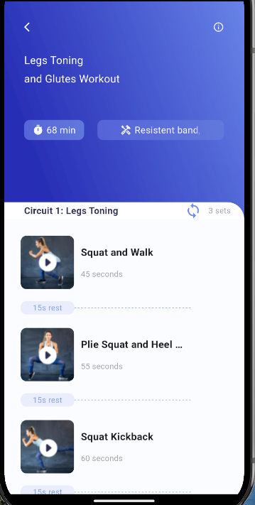

<div align="center">
  
</div>

# Training GetX App 🏋️‍♂️

A beautiful fitness application built with Flutter and GetX, featuring video playback, workout tracking, and a sleek UI design.

<div align="center">
  
  
</div>

## ✨ Features

<details>
<summary>🎯 Home Screen</summary>

- Beautiful gradient cards with workout information
- Interactive workout areas with grid layout
- Progress tracking section
- Clean and intuitive navigation
</details>

<details>
<summary>🎥 Video Player</summary>

- Custom video player controls
- Video progress tracking
- Playlist management
- Auto-play next functionality
- Volume controls
</details>

<details>
<summary>🎨 UI Components</summary>

- Custom gradient backgrounds
- Responsive layouts using ScreenUtil
- Shadow effects and rounded corners
- Animated transitions
- Custom icons and typography
</details>

<details>
<summary>📱 State Management</summary>

- GetX for state management
- Clean architecture principles
- Efficient video controller handling
- JSON data parsing
</details>

## 🛠️ Technical Implementation

### Project Structure

### Key Components

#### 🎨 Colors & Theming
The app uses a carefully crafted color palette defined in `colors.dart`:
- Gradient combinations for cards
- Text colors for different contexts
- Background colors for sections
- Icon colors for consistency

#### 📱 Responsive Design
- Implemented using `flutter_screenutil`
- Adaptive layouts for different screen sizes
- Consistent spacing and sizing

#### 🎥 Video Player Features
- Custom controls overlay
- Progress tracking
- Playlist navigation
- Volume controls
- Auto-play functionality

## 🚀 Getting Started

1. Clone the repository

```bash
git clone https://github.com/yourusername/training_getx.git
```

2. Install dependencies
```bash
flutter pub get
```

3. Run the app
```bash
flutter run
```

## 📦 Dependencies

- `get: ^4.6.5` - State management
- `video_player: ^2.7.0` - Video playback
- `flutter_screenutil: ^5.8.4` - Responsive design

## 🤝 Contributing

Contributions are welcome! Please feel free to submit a Pull Request.


<div align="center">
  
</div>
